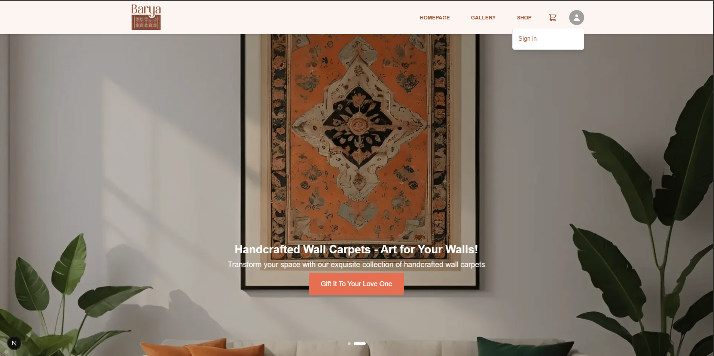

# Barya Carpets



Welcome to the Barya Carpets project. This application provides a seamless experience for users to explore and purchase high-quality carpets.

## Table of Contents

- [Features](#features)
- [Installation](#installation)
- [Usage](#usage)
- [Technologies Used](#technologies-used)
- [Project Structure](#project-structure)
- [Contributing](#contributing)
- [License](#license)
- [Contact](#contact)
- [Additional Resources](#additional-resources)

## Features

- **User Authentication**: Secure login and registration using NextAuth.js.
- **Responsive Design**: Fully responsive layout for all devices.
- **Product Catalog**: Browse a wide range of carpets with detailed descriptions and images.
- **Shopping Cart**: Add, remove, and manage items in your cart.
- **User Profile**: Manage account settings and preferences.
- **Dark Mode**: Toggle between light and dark themes.
- **Search Functionality**: Easily find products with advanced search options.

## Installation

1. **Clone the repository**:
   ```bash
   git clone https://github.com/Qk-Ahmadzai/barya-carpts.git
   cd barya-carpts
   ```

2. **Install dependencies**:
   ```bash
   npm install
   ```

3. **Run the development server**:
   ```bash
   npm run dev
   ```

4. **Open your browser** and navigate to `http://localhost:3000`.

## Usage

- **Browse Products**: Explore the catalog and view product details.
- **Authentication**: Sign up or log in to access personalized features.
- **Cart Management**: Add items to your cart and proceed to checkout.
- **Profile Settings**: Update your account information and preferences.

## Technologies Used

- **Next.js**: React framework for server-side rendering and static site generation.
- **Tailwind CSS**: Utility-first CSS framework for styling.
- **NextAuth.js**: Authentication for Next.js applications.
- **Heroicons**: Beautiful hand-crafted SVG icons.
- **React**: JavaScript library for building user interfaces.

## Project Structure

- **/app**: Contains the main application components and pages.
- **/components**: Reusable UI components like Navbar, Footer, and UserMenu.
- **/styles**: Global styles and theme configurations.
- **/public**: Static assets like images and icons.

## Contributing

Contributions are welcome! Please fork the repository and submit a pull request.

## License

This project is licensed under the MIT License.

## Contact

For more information, please contact QkAhmadzai at QkAhmadzai2016@gmail.com.

## Additional Resources

[View Barya Carpet PDF](./barya-carpet.pdf)
-
